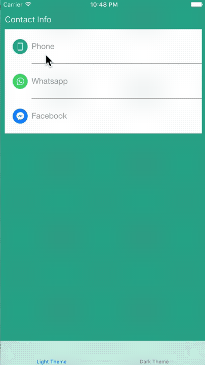
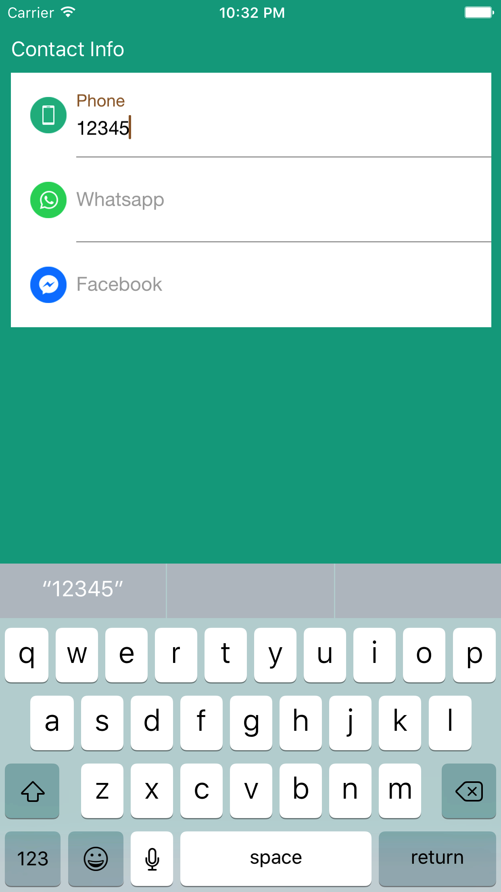
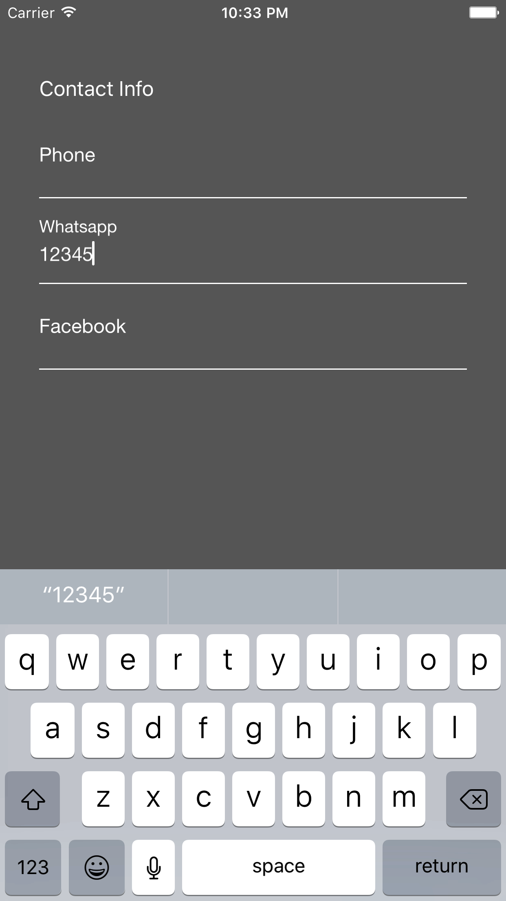

# RSFloatInputView

[](http://cocoapods.org/pods/RSFloatInputView)
[](http://cocoapods.org/pods/RSFloatInputView)
[](http://cocoapods.org/pods/RSFloatInputView)

## Features
* Smooth animation using CoreText
* Support optional left icon
* Support optional seperator
* Configurable padding, size, fonts and colors
* Ready for multi styles
* Ready for string localization
* Configurable in interface builder

## Demo

[Yotube Video Demo](https://youtu.be/_08pUzXVp5s "Youtube")






## Customization

```
func application(_ application: UIApplication, didFinishLaunchingWithOptions launchOptions: [UIApplicationLaunchOptionsKey: Any]?) -> Bool {
    RSFloatInputView.stringTransformer = {
      orginal in
      // Transform the place holder string configured in XIB with your own way.
      // e.g return NSLocalizedString(orginal, comment: orginal)
      return orginal.replacingOccurrences(of: "TXT_", with: "")
    }
    RSFloatInputView.instanceTransformer = {
      instance in
      // Support multi-styles in one place using the tag
      if instance.tag == 0 {
        instance.floatPlaceHolderColor = UIColor.brown
        instance.textColor = UIColor.darkText
        instance.tintColor = UIColor.brown
      }
      if instance.tag == 1 {
        instance.floatPlaceHolderColor = UIColor.blue
        instance.textColor = UIColor.darkText
        instance.tintColor = UIColor.blue
      }
    }
    return true
  }
```

## Requirements
* iOS 8.0
* Swift 4.1

## Installation

RSFloatInputView is available through [CocoaPods](http://cocoapods.org). To install it, simply add the following line to your Podfile:

```ruby
pod "RSFloatInputView"
```

## Author

Roy Ng, roytornado@gmail.com
@ Redso, https://www.redso.com.hk/

Linkedin: https://www.linkedin.com/in/roy-ng-19427735/

## License

RSFloatInputView is available under the MIT license. See the LICENSE file for more info.
